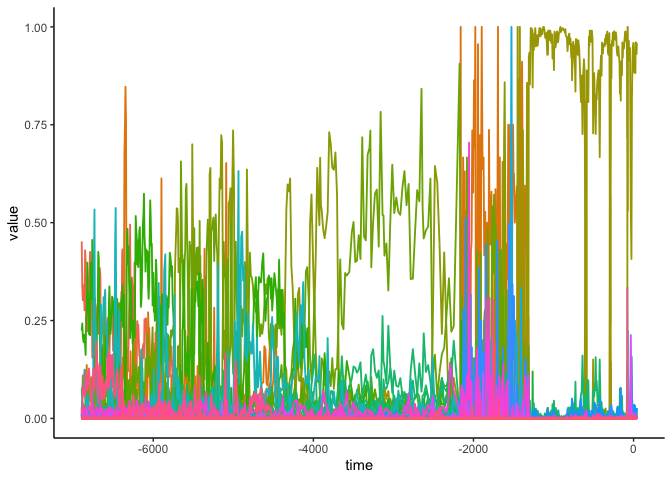
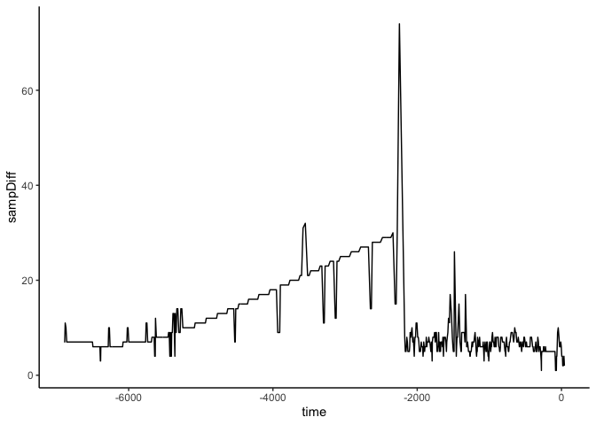
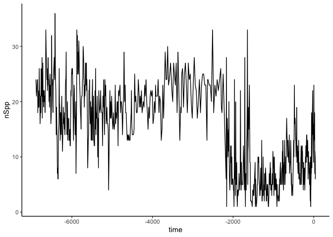
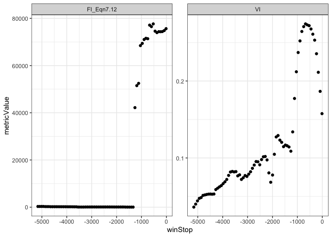
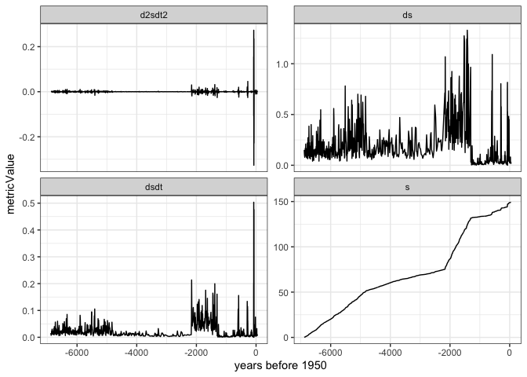

About
=====

This package will calculate a various regime detection metrics that have
been used to ‘detect ecological regime shifts’. A ‘new’ metric,
**distance travelled** is also calculated (Burnett and others, *in
prep*).

This package calculates multiple metrics which I have categorized into
two types: 1. COMPOSITE: 1. Distance travelled -see also package
[`distanceTravelled`](https://github.com/TrashBirdEcology/distanceTravelled).
1. Fisher Information 1. Variance Index

1.  UNIVARIABLE:
    1.  Skewness (mean and mode versions)
    2.  Kurtosis
    3.  Variance
    4.  Mean
    5.  Mode
    6.  Coefficient of variation, CV
    7.  Autocorrelation lag-1 (using `stats::acf`)

The UNIVARIABLE metrics are calculated using a moving-window analysis
and can handle only individual state variables. That is, you will get
one measurement per state variable. The COMPOSITE metrics can handle an
infinite number of state variables, and will return a single measurement
at each time point. It should be noted that the **Fisher Information**
can be calculated using multiple methods (see the function description
for `rdm_window_analysis` for more details).

Install package and load
========================

``` r
devtools::install_github("trashbirdecology/regimedetectionmeasures", force=FALSE)
```

Load the package

``` r
library(regimeDetectionMeasures)
ggplot2::theme_set(theme_bw())
```

Munge and explore the original data
===================================

The function munge\_orig\_dat will munge your original dataset. If no
data is provided in the argument `data`, it will download an example
dataset from \[Spanbauer\]\[1\] \*[link to original
data](https://journals.plos.org/plosone/article?id=10.1371/journal.pone.0108936).

``` r
origData <-  munge_orig_dat(example = TRUE)
```

    ## Parsed with column specification:
    ## cols(
    ##   .default = col_double(),
    ##   Sample = col_character()
    ## )

    ## See spec(...) for full column specifications.

``` r
# glimpse(origData)
```

If the argument for `fill` is not specified, the function
`munge_orig_dat` will fill in missing species by time observations with
zero (‘0’). If data are true zeroes, in that a missing observation is
not an NA, but is rather something else, this can be specified:

``` r
origData <- munge_orig_dat(example = TRUE, fill=NA) %>% glimpse()
```

    ## Parsed with column specification:
    ## cols(
    ##   .default = col_double(),
    ##   Sample = col_character()
    ## )

    ## See spec(...) for full column specifications.

    ## Observations: 83,167
    ## Variables: 5
    ## $ site     <chr> "Foy", "Foy", "Foy", "Foy", "Foy", "Foy", "Foy", "Foy",…
    ## $ sortVar  <dbl> -6893.73, -6886.68, -6879.65, -6869.12, -6858.62, -6851…
    ## $ variable <chr> "Acnanthidium minutissimum", "Acnanthidium minutissimum…
    ## $ value    <dbl> 0, 0, 0, 0, 0, 0, 0, 0, 0, 0, 0, 0, 0, 0, 0, 0, 0, 0, 0…
    ## $ cellID   <dbl> 1, 1, 1, 1, 1, 1, 1, 1, 1, 1, 1, 1, 1, 1, 1, 1, 1, 1, 1…

Next, we can visualzie the original data using a few different
functions:

We can plot the original time series:

``` r
plot_orig_data(data = origData)
```



We can inspect the time beteween observations (i.e., is sampling
regular, or irregular?):

``` r
plot_timeDiff(data = origData)
```

    ## Warning: Removed 1 rows containing missing values (geom_path).


<p class="caption">
Sampling is irregular for the paleodiatom example data from Spanbauer et
al. (2014).
</p>

We can examine if species richness, or the number of unique state
variables changes over time:

``` r
plot_richness(data = origData,
              example = F,
              print = T)
```


<p class="caption">
Species richness exhibits a sharp decline before time=-2000.
</p>

Calculate Regime Detection Measures: Velocity and Distance Travelled
====================================================================

Next, we want to calculate the distance travelled, velocity, and
acceleration measures. This requires the data input `dataInDist` to have
the following column names: c(“sortVar”, “variable”,“value”). If the
column ‘site’ exists, and multiple sites are sampled, then the metrics
will be calculated at each site independent of one another. Our example
data \[1\] has a unique site, ‘Foy’ (Foy Lake).

``` r
distance.results <- calculate_distanceTravelled(origData, derivs = TRUE) %>% 
    gather(key=metricType, value=metricValue, -cellID,-sortVar)
# glimpse(distance.results)
unique(distance.results$metricType) 
```

    ## [1] "ds"     "s"      "dsdt"   "d2sdt2"

This function outputs the following variables: - cellID: this is
imputed, and can be ignored. This is used for the package `bbsRDM` -
sortVar: this is the ‘x-axis’ variable; usually, this will be time, but
if conducting spatial analyses, can be space (e.g. longitude) - ds: this
is the total change in system variables between the current and previous
time point. This value can take on any number or sign, and is uniquely
calculated for every time step **except the first** - s: this the the
*distance travelled* metric. It is used to calculate the velocity
(*dsdt*), and is calculated at each time step as the cumulative sum of
**s**. - dsdt (*v*): this is the velocity measurement. It is calculated
as the speed of **S** at each time step. This is the first derivative of
**s**, **s^’** -d2sdt2: this is the acceleration of **s** at each time
step. This is the second derivative of **s**, **s^’’**.

Calculate Regime Detection Measures: Fisher Information, Variance Index and other early warning signals
=======================================================================================================

Calculate Fisher Inforamtion, Variance Index, and other univariate early
warning signals using a moving-window approach. Results are all given in
a long formatted data frame.

``` r
# remove the site variable
ews.results <- rdm_window_analysis(origData %>% dplyr::select(-site))
```

    ## Loading required package: caTools

``` r
glimpse(ews.results)
```

    ## Observations: 35,135
    ## Variables: 8
    ## $ metricValue <dbl> 0.1575755, 0.1865338, 0.2113044, 0.2354512, 0.253069…
    ## $ cellID_min  <dbl> 1, 1, 1, 1, 1, 1, 1, 1, 1, 1, 1, 1, 1, 1, 1, 1, 1, 1…
    ## $ cellID_max  <dbl> 1, 1, 1, 1, 1, 1, 1, 1, 1, 1, 1, 1, 1, 1, 1, 1, 1, 1…
    ## $ winStart    <dbl> -1746.63, -1820.16, -1893.69, -1967.22, -2040.75, -2…
    ## $ winStop     <dbl> -12.6975, -86.2275, -159.7575, -233.2875, -306.8175,…
    ## $ metricType  <chr> "VI", "VI", "VI", "VI", "VI", "VI", "VI", "VI", "VI"…
    ## $ variable    <chr> "NA", "NA", "NA", "NA", "NA", "NA", "NA", "NA", "NA"…
    ## $ cellID      <dbl> NA, NA, NA, NA, NA, NA, NA, NA, NA, NA, NA, NA, NA, …

Note the default of this function is to return VI (variance index), FI
(fisher information), central tendencies and variance, CV (coefficient
of variation), and skewness (using the mean and mode calculations):

``` r
ews.results %>% distinct(metricType)
```

    ##   metricType
    ## 1         VI
    ## 2 FI_Eqn7.12
    ## 3       mean
    ## 4       mode
    ## 5         sd
    ## 6         CV
    ## 7   kurtosis
    ## 8   skewMode
    ## 9   skewMean

Visualize the Results
=====================

Fisher Information & Variance Index
-----------------------------------

Use any method to visualize the results. Here, we use `ggplot` to
visualize FI and VI, since these are metrics obtained for multiple
species over time, rather than a single species over time.

``` r
fi.vi <- ews.results %>% filter(metricType  %in% c("FI_Eqn7.12", "VI"))

# Visualize using the window stop time, since these were moving window anlayses
ggplot(data = fi.vi, aes(x=winStop, y = metricValue))+
    geom_point() +
    facet_wrap(~metricType, scales = "free_y")
```



Distance Travelled and Velocity
-------------------------------

Use any method to visualize the results. Here, we use `ggplot` to
visualize the distance travelled and the velocity of the distance
travelled.

``` r
# Visualize using the window stop time, since these were moving window anlayses
ggplot(data = distance.results, aes(x=sortVar, y = metricValue))+
    geom_line() +
    facet_wrap(~metricType, scales = "free_y")+xlab("years before 1950")
```

    ## Warning: Removed 2 rows containing missing values (geom_path).


